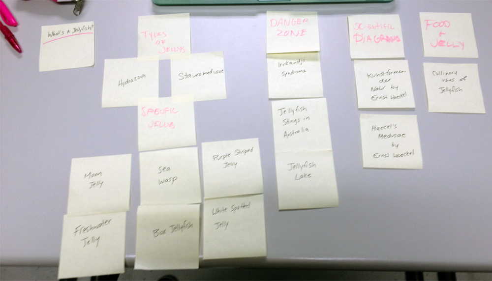
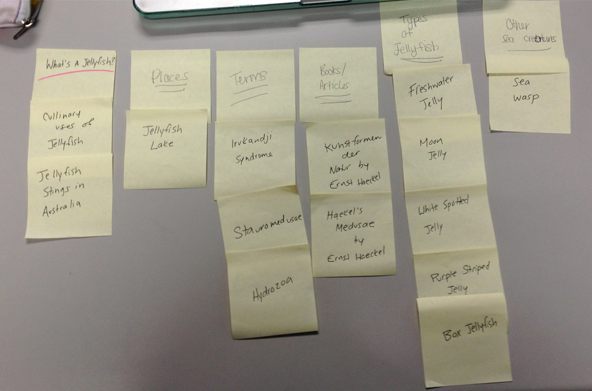

# Card sort report

The purpose of this card sort was to determine common navigation patterns and categories from the content of the jellyfish website..

## Specifics

The card sort was conducted by Sabrina Ng on Tuesday September 10, 2013 between the times of 8am and 11am with the following participants:

- Laura Harvey
- Stephanie Csanky

### Cards

15 cards were used covering a broad range of applicable content for the website. The following topics were used as cards:

1. What is a jellyfish?
2. Hydrozoa
3. Stauromedusae
4. Moon Jelly
5. Sea Wasp
6. Purple Striped Jelly
7. Freshwater Jelly
8. Box Jellyfish
9. White Spotted Jelly
10. Irukandji Syndrome
11. Jellyfish Stings in Australia
12. Jellyfish Lake
13. Kunstformen der Nature (Ernst Haeckel)
14. Haeckel's Medusae (Ernst Haeckel)
15. Cullinary Uses of Jellyfish

## Card sort results

*Card sort 1 by Laura Harvey*

*Card sort 2 by Stephanie Csanky*

## Observations
The participants commonly were confused by certain scientific title topic cards, as it would probably take someone who is an expert/did research about jellyfish to recognize them. Their main questions were related to that, for example, *what is a hydrozoa?* The easiest topic for them to understand, and the one that was most commonly grouped together was the different jellyfish breeds (ex: *white spotted jelly, moon jelly*). The groupings were generally similar. The only difference was when the participant didn't know what something was so they put it in its own category, for example in card sort 2, *sea wasp* was put under *other sea creatures*, when, despite its misleading name, is a type of jellyfish as well. Besides simple mistakes like that the groupings were pretty expected, and generally similar to what I had expected. I felt fine when watching them perform the task, their sortings were generally to my expectations so I believe it went well. 
